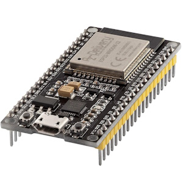

# VETRONIC ESP32 OTA

Permet le contrôle à distance de la borne de recharge [VE-TRONIC WB-01](http://ve-tronic.fr/store/wallbox) par [Jeedom](https://www.jeedom.com) (ou tout autre domotique) via un ESP32.

## Présentation

Ce projet permet de communiquer en RS232 avec la borne VE-TRONIC par l'intermédiaire d'une requête HTTP. 
La commande à envoyer à la borne est intégrée à la requête HTTP et l'ESP32 retourne un résultat en XML que Jeedom (ou autre logiciel de domotique) pourra facilement interpréter. 
Côté Jeedom, il faut juste utiliser le plugin [Script](https://market.jeedom.com/index.php?v=d&p=market_display&id=20) et d'utiliser le parser XML intégré pour récupérer les valeurs. Pour envoyer une commande à la borne, le même plugin permet d'envoyer une requête HTTP simplement.

Pour faciliter la configuration et la maintenance logicielle du module ESP32, un serveur Web est intégré ainsi que le manager WiFi [AutoConnect](https://github.com/Hieromon/AutoConnect) permettant la configuration du WiFi mais également la mise à jour du firmware de l'ESP32 par OTA.
Le serveur web intégré à l'ESP32 permet d'envoyer des commandes manuellement à la borne et d'afficher la réponse retournée via une IHM simple.
La première programmation de l'ESP32 devra être réalisé par USB, les mises à jours pourront être faites directement depuis la page Web en sélectionnant le fichier binaire à charger.

## Materiels

- [ESP32 NodeMCU](https://www.amazon.fr/dp/B071P98VTG) (ou un de ses nombreux clones)

- [Une Board MAX3232](https://www.amazon.fr/gp/product/B07ZDK4BLH)
- [un Câble RS232 mâle / mâle croisé](https://www.amazon.fr/dp/B08LPT8RMF?th=1) pour ma part je l'ai fabriqué en achetant 2 prises RS232 mâle et du câble électrique pour le faire à la bonne longueur. 

## Change log

### [v1.0] 5 août 2023
- Première version

## License

License under the [MIT license](LICENSE).
